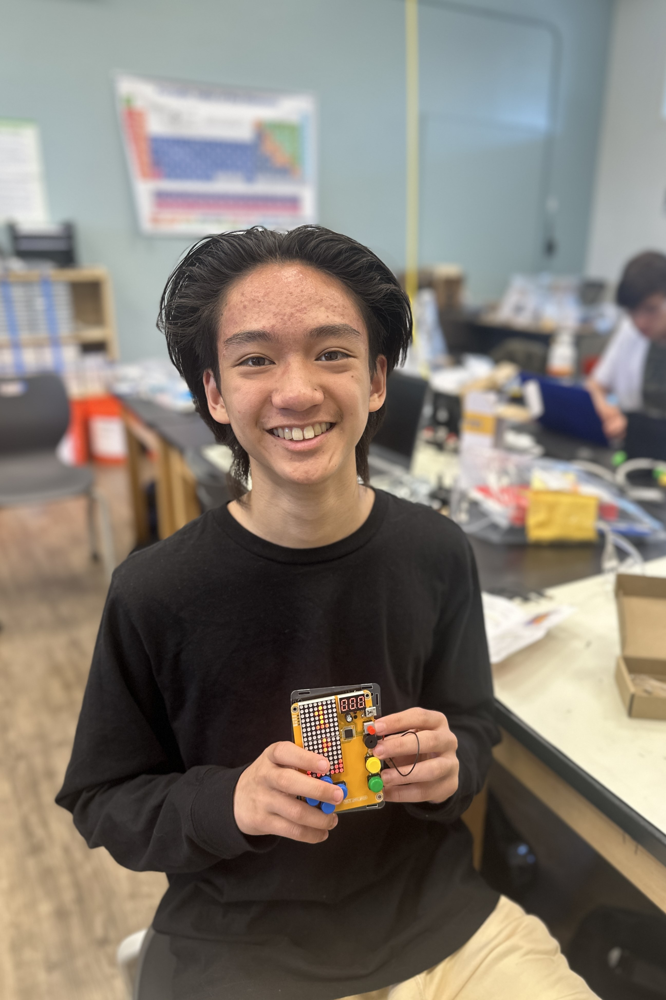

Gesture Controlled Robot

<!--Replace this text with a brief description (2-3 sentences) of your project. This description should draw the reader in and make them interested in what you've built. You can include what the biggest challenges, takeaways, and triumphs from completing the project were. As you complete your portfolio, remember your audience is less familiar than you are with all that your project entails! -->

| **Norrin A** | **Dougherty Valley High School** | **Mechanical Engineering** | **Incoming Junior** |




<!--
  
# Final Milestone

**Don't forget to replace the text below with the embedding for your milestone video. Go to Youtube, click Share -> Embed, and copy and paste the code to replace what's below.**

<iframe width="560" height="315" src="https://www.youtube.com/embed/F7M7imOVGug" title="YouTube video player" frameborder="0" allow="accelerometer; autoplay; clipboard-write; encrypted-media; gyroscope; picture-in-picture; web-share" allowfullscreen></iframe>

For your final milestone, explain the outcome of your project. Key details to include are:
- What you've accomplished since your previous milestone
- What your biggest challenges and triumphs were at BSE
- A summary of key topics you learned about
- What you hope to learn in the future after everything you've learned at BSE

-->


# Second Milestone - June 20, 2024

<!--

**Don't forget to replace the text below with the embedding for your milestone video. Go to YouTube, click Share -> Embed, and copy and paste the code to replace what's below.**

-->

<iframe width="560" height="315" src="https://www.youtube.com/embed/TSlqBtQLMxg?si=DDPktpHAoMY3l5B3" title="YouTube video player" frameborder="0" allow="accelerometer; autoplay; clipboard-write; encrypted-media; gyroscope; picture-in-picture; web-share" referrerpolicy="strict-origin-when-cross-origin" allowfullscreen></iframe>

<!--

For your second milestone, explain what you've worked on since your previous milestone. You can highlight:

-->

Up until my second milestone, I paired the transmitter and receiver Bluetooth modules together. First, I inputted commands to the receiver module, training it to be the receiver module. Using the address given by the receiver module, I assigned the transmitter module to its receiver. Then, I also ensured that the transmitter module knew that it was the transmitter module. Afterward, I uploaded separate codes to the robot, using the Arduino Uno, and the glove, using the Arduino Nano. Something that surprised me so far was how difficult it would be to pair two Bluetooth modules together. At first, the Bluetooth modules didn't pair together but with troubleshooting, I realized that my RX (the receiver module) and TX (the transmitter module) weren't connected to the right pins on my Arduino Uno. I also changed the battery pack of 4 AA batteries to a 9V battery. This would soon prove to be more consistent and powerful than the 4 AA batteries that I was previously using.

<!-- 


- For my final milestone, I plan on finishing the chassis of the robot and adding the velcro to the breadboard for the glove.

-->

# First Milestone - June 19, 2024

<!--

**Don't forget to replace the text below with the embedding for your milestone video. Go to Youtube, click Share -> Embed, and copy and paste the code to replace what's below.**
-->

<iframe width="560" height="315" src="https://www.youtube.com/embed/kYBrKpNs_0c?si=Xsxn6HwXDczbrZ2b" title="YouTube video player" frameborder="0" allow="accelerometer; autoplay; clipboard-write; encrypted-media; gyroscope; picture-in-picture; web-share" referrerpolicy="strict-origin-when-cross-origin" allowfullscreen></iframe>


Up until my first milestone, I assembled the chassis of the car. I connected the four servo motors to the L298 motor driver and the Arduino Uno. I soldered the wires to the L298 motor driver and connected a battery pack consisting of 4 AA batteries to the L298 motor driver. After tweaking code previously used online, I uploaded the code from my computer to the Arduino Uno. 

A problem I faced during my first assembly process was that my wheels were always inverse of each other. Two wheels spun in one direction and the other two spun in the other. 
I found the solution when I realized that the assembly of my wires from the servo motors was inverted. Thus, the wheels were always inversed despite the code that I ran.
After properly soldering the wires in the proper order, all four of my wheels spun in sync.
Something surprising that I found during this first phase was using Arduino IDE. Even though it is my first time coding, my instructors were able to guide me and explain to me various functions and commands.

My next step is to add the Bluetooth component to the car and connect it to the glove to enable steering.

# Starter Project - June 14, 2024


<iframe width="560" height="315" src="https://www.youtube.com/embed/-_DDak3KmOk?si=5Ynht2R5_4MEFsdl" title="YouTube video player" frameborder="0" allow="accelerometer; autoplay; clipboard-write; encrypted-media; gyroscope; picture-in-picture; web-share" referrerpolicy="strict-origin-when-cross-origin" allowfullscreen></iframe>

- Retro Game Arcade Console. Play between Tetris and Snake.
- With the motherboard in the middle, I connected six buttons to control different functions. There is a capacitor that stores energy, a speaker that houses the audio unit, and there are three LED displays that provide visuals to the games. 
As I was finishing my soldering, I accidentally burned into the button of my console, rendering the button useless. Thus, using a replacement button, I desoldered the original and replaced it with the functional one.
- My next step is to work on my main project: Gesture-controlled robot


<!--
An explanation about the different components of your project and how they will all integrate together:
# Schematics 
Here's where you'll put images of your schematics. [Tinkercad](https://www.tinkercad.com/blog/official-guide-to-tinkercad-circuits) and [Fritzing](https://fritzing.org/learning/) are both great resoruces to create professional schematic diagrams, though BSE recommends Tinkercad becuase it can be done easily and for free in the browser. 

# Code
Here's where you'll put your code. The syntax below places it into a block of code. Follow the guide [here]([url](https://www.markdownguide.org/extended-syntax/)) to learn how to customize it to your project needs. 

```c++
void setup() {
  // put your setup code here, to run once:
  Serial.begin(9600);
  Serial.println("Hello World!");
}

void loop() {
  // put your main code here, to run repeatedly:

}
```
-->
# Bill of Materials

| **Part** | **Note** | **Price** | **Link** |
|:--:|:--:|:--:|:--:|
| Arduino UNO | What the item is used for | $27.69 | <a href="https://www.amazon.com/Arduino-A000066-ARDUINO-UNO-R3/dp/B008GRTSV6/"> Link </a> |
| Arduino Nano | What the item is used for | $9.99 | <a href="https://www.amazon.com/TISEKER-ATmega328P-Microcontroller-Board-Arduino/dp/B0BGSXWKCM/ref=sr_1_6?dib=eyJ2IjoiMSJ9.DuUAPNKOZx3V-ph33HzyN0M-73jcP_H0KcW1aHgUufjV7lJPV4TYzgsQMxUkbhufBhMMFAL4SjgOxP8EpP9_Q39ErGkaalZubGX7qjqxr9Z5KdHSA_OL7s3w5lvoQC5iBBhG5gDx9MYyLH44W_MukLN2lN4_nke9QnYKr2y2jezvcojfWOUVNHAZFicP8x3XNqSHQDonDQFQruNCuhv3r8oWUYL1EchiciUQfD-iffA.vt4rWEyH9F9lgL1wtp7lSGb9hADagBkBtXTHMJTVGRE&dib_tag=se&hvadid=570571296416&hvdev=c&hvlocphy=9032183&hvnetw=g&hvqmt=e&hvrand=15173083804068026480&hvtargid=kwd-44438573049&hydadcr=18005_13462305&keywords=arduino+nano+r3&qid=1718408211&sr=8-6"> Link </a> |
| MPU 6050 Accelerometer | Using the built-in gyroscope, the accelerometer can measure the angle of the tilt around the accelerometer | $9.90 | <a href="https:/www.amazon.com/Pre-Soldered-Accelerometer-Raspberry-Compatible-Arduino/dp/B0BMY15TC4/ref=sr_1_4?crid=39M8WPTG2TMBM&dib=eyJ2IjoiMSJ9.nQ-HfKOFyZoszrV3cxLK6stPzn4eOISYIBYbmDYSRsXiWsze7vqDPWtd62qWOkoaIn0bezgLZYnjo_EM-cOJcu0t0BbsJhTeUxhYzjTD15_1OTx4sQ_cbZok4MKJaIV3y0_1iOe2RY0gZFbV3bGzr6tOLUL56rajYTnOAO8vXafXh2A_17s62GCXQjQvzj4ADWlY4uKstUDdih1ftEYJqQGrSol_dSQCCh2jc8T4aLE.q5TvndnYyhDpmjXDX9Yo0n0LdABxVRLPyyztup4eMnU&dib_tag=se&keywords=mpu+6050&qid=1719270962&sprefix=mpu+%2Caps%2C143&sr=8-4"> Link </a> |
| HC-05 Bluetooth Modules (x2) | The 2 connected Bluetooth modules are used to relay inputs from the Arduino Nano to the Arduino Nano | $9.99 each | <a href="https://www.amazon.com/DSD-TECH-HC-05-Pass-through-Communication/dp/B01G9KSAF6/ref=sr_1_3?crid=EFPP8ND0F5S7&dib=eyJ2IjoiMSJ9.GVe7xTdQBd8ycP5WU8ZbiQa5ABtI2bM6FlQhDvE7qEehbVcaugJQgfkVGgef-i5r_1ATgBKUe8c_pefUUiDCoTKoyKZDy0mGu9GyyxFREd_-f_bjNKNDNngbCzsDiJ6gPtukSd0aqRDAcI1GqmS702lhj-zRN7ETA0sYIxnIUQahAU0RS5p-k-NMcJIAPLfw1gXy7La21yMUCpYcYUHjBxoovm2ZG2gIM3BpsjRh-gg.p0dGgL2vGTRsIhjiIXUL57BuG6ru1MfQf12zRsbslC8&dib_tag=se&keywords=hc+05+bluetooth+module+arduino&qid=1719271041&sprefix=hc+05+%2Caps%2C159&sr=8-3"> Link </a> | 
| 4 pack of DC Motors 3V-12V | These motors are used to turn the wheels of the car | $6.99 | <a href="https://www.amazon.com/DiGiYes-Electric-Motor-3V-12V-Shaft/dp/B0BSP7ZG1B/ref=sims_dp_d_dex_ai_speed_loc_touchpoints_mtl_t2_d_sccl_2_7/139-6116827-4803538?pd_rd_w=lRYuJ&content-id=amzn1.sym.b60dadd9-7f9e-4256-887b-3cfe6cc8c59d&pf_rd_p=b60dadd9-7f9e-4256-887b-3cfe6cc8c59d&pf_rd_r=NCMT3XF76ENRZYJHWJCP&pd_rd_wg=fyHul&pd_rd_r=82b2b014-4031-484a-b6be-443b5be96508&pd_rd_i=B0BSP7ZG1B&psc=1"> Link </a> |
| 9V Battery Clip Connector | This connector allows the 9V to power the rest of my robot | $2.99 | <a href="https://www.amazon.com/RUZYY-Battery-Connector-Tinned-Leads/dp/B082DZ6YQJ/ref=sr_1_6?crid=3DET1PVSSRZN6&dib=eyJ2IjoiMSJ9.utuRXJZ_9zaFZGsXjVdqQCJxhQYbgeWwNkGW_nY5J_gfFUUewzBhhObJQyqwhz1qboz5yr4LsIemuTwIGrCfkAxr1DN4ZMHZSj9pSa8N4Pg49MeBGH51apODYq39ILY4P6W1cL-FKvUSnowbYofMuRdp2CUhZ31k3nmgcTKjRGV_KnigS67N6GkS80ZXjVobIuipsYHQM4KIm-Biip7DUD1GXA0z51YnmZkI6ZqmQmlZhstBL3aHIbIU5GOJ9l0tFWjEr0wTUdL9B5LPXQYdwsF5GnKGv97SgVUH5qT46Rw.PuYx2Qib6BuAqwAOc4Flb6Fr9Nie0rdAOvf1NiI2-Ww&dib_tag=se&keywords=9V+battery+with+connector&qid=1719272877&s=industrial&sprefix=9v+battery+with+connector%2Cindustrial%2C132&sr=1-6"> Link </a> |

<!--# Other Resources/Examples
One of the best parts about Github is that you can view how other people set up their own work. Here are some past BSE portfolios that are awesome examples. You can view how they set up their portfolio, and you can view their index.md files to understand how they implemented different portfolio components.
- [Example 1](https://trashytuber.github.io/YimingJiaBlueStamp/)
- [Example 2](https://sviatil0.github.io/Sviatoslav_BSE/)
- [Example 3](https://arneshkumar.github.io/arneshbluestamp/)

To watch the BSE tutorial on how to create a portfolio, click here.
-->
