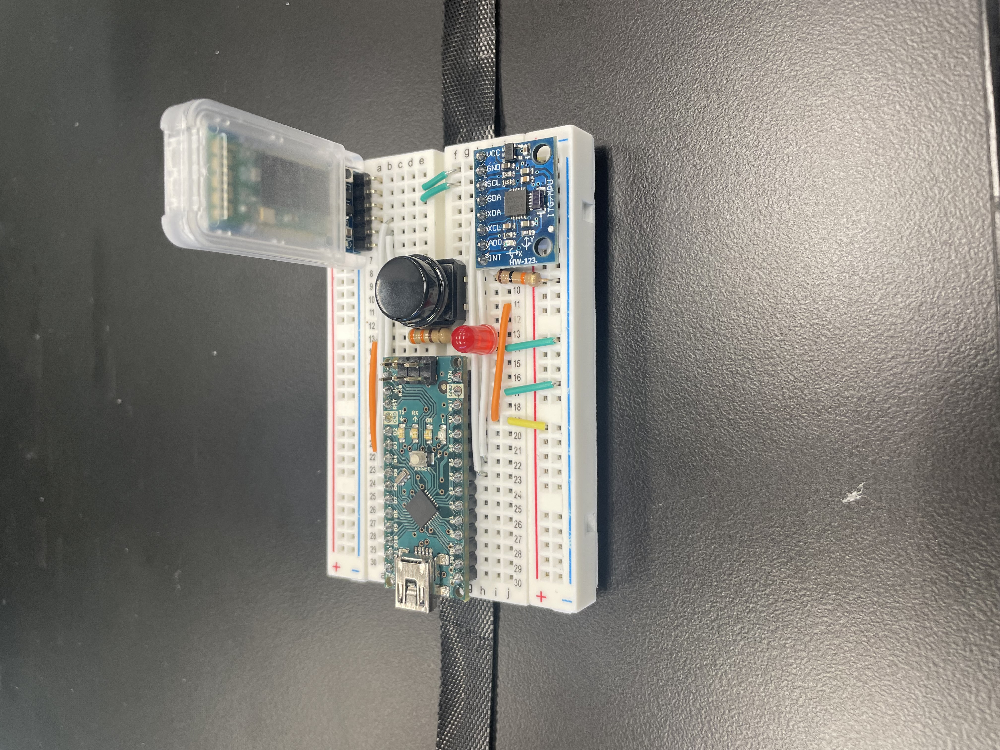
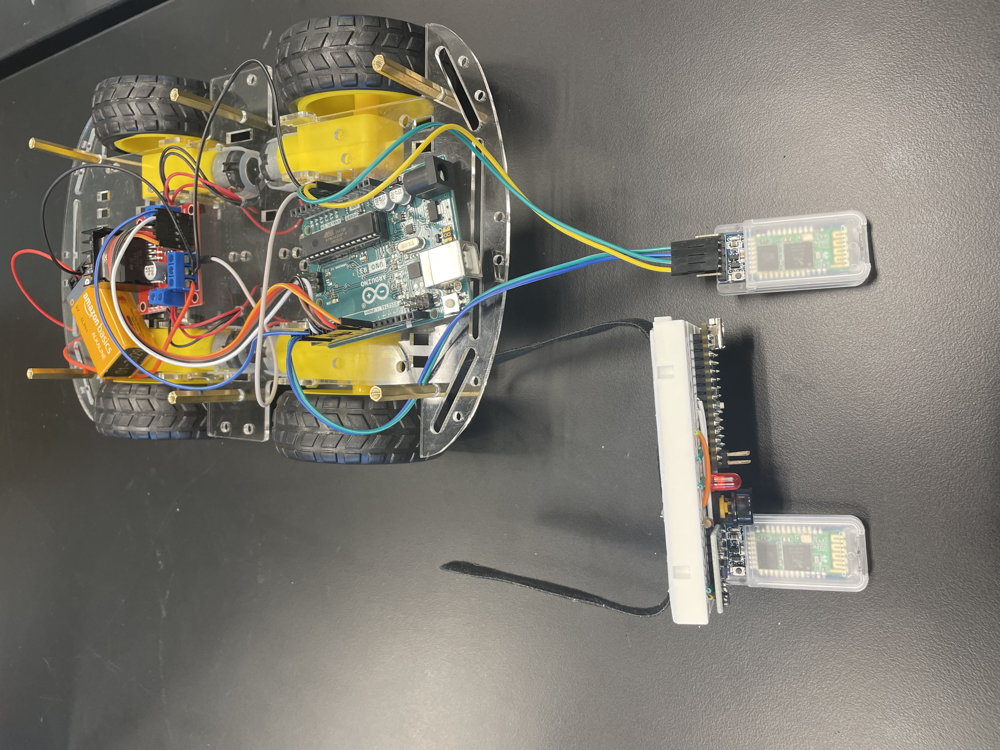
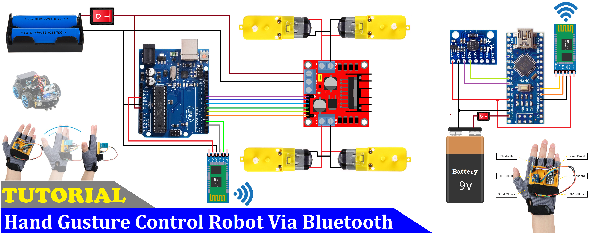

Gesture Controlled Robot

With a turn of a hand, the gesture-controlled robot changes its course of direction. Compact and wireless, a glove strapped to a person's hand measures the tilt of your hand and relays these inputs using a Bluetooth module to the robot. The Arduino Uno (microcontroller) uses these inputs to articulately turn the four servo motors in sync.

<!-- You can include what the biggest challenges, takeaways, and triumphs from completing the project were. As you complete your portfolio, remember your audience is less familiar than you are with all that your project entails! -->

| Norrin A | Dougherty Valley High School | Mechanical Engineering | Incoming Junior |


<p> align = "center"> 
  
</p>

# Modification - July 5, 2024

<iframe width="560" height="315" src="https://www.youtube.com/embed/LeT4ZPPdnww?si=4IwYQt-L5Fl9FiUL" title="YouTube video player" frameborder="0" allow="accelerometer; autoplay; clipboard-write; encrypted-media; gyroscope; picture-in-picture; web-share" referrerpolicy="strict-origin-when-cross-origin" allowfullscreen></iframe>

My modification for my project was to add a return/retrieval function to the robot. This return feature would enable me to bring the robot back to where it started. My modification consisted of different parts: the input, the counter and recorder, and the playback. Because the modification was heavily focused on code, I previously researched different ways I could take to achieve my goal. First, I shifted my attention to creating separate input to enable the entire function. I experimented with using AcZ values and certain degrees of AcX and AcY values, similar to the original inputs to the car, but, I finally landed upon using a button as it proved to be reliable. Next, with the aid of my instructor, Ben, I designed the counter and recorder using int (integers) and bools. The counter recorder counts the time that the button is held, allowing the rest of the return feature to run. Similarly, the recorder records the movements sent to the robot once the return feature is enabled. The playback part of the return feature was tricky as I had to move my reading of the inputs down one by one until no other inputs were left in the recorder. Below is a picture of my modified glove with the two additional resistors, LED light, and button.

  
</p>


# Modified Glove Code 
```C++
#include <SoftwareSerial.h>
SoftwareSerial BT_Serial(3,2); // RX, TX

#include <Wire.h> // I2C communication library

const int MPU = 0x68; // I2C address of the MPU6050 accelerometer
int16_t AcX, AcY, AcZ;
int startcounter=0; // adds the integer startcounter
int endcounter=0; // adds the integer endcounter
bool recorder = false; // adds the bool (true or false) recorder as false

char array[300] = {}; // adds the character array and sets it to hold  300 values
int arraytime[300] = {}; // adds the integer array time and sets that to hold 300 values
char current; // adds the character current
int index = 0; // adds the integer index and sets it to 0

bool playback = false; // adds the bool playback and sets it to false

const int button = 5; // constantly reads the integer button to D5 on the Arduino Nano
const int redlight = 4; // constantly reads the integer redlight to D4 on the Arduino Nano

bool lighton = false; // adds the bool lighton and sets it to false

void setup () {// put your setup code here, to run once

Serial.begin(9600); // start serial communication at 9600bps
BT_Serial.begin(9600); 

// Initialize interface to the MPU6050
Wire.begin();
Wire.beginTransmission(MPU);
Wire.write(0x6B);
Wire.write(0);
Wire.endTransmission(true);

delay(500); 

pinMode(button, INPUT);
pinMode(redlight, OUTPUT);

}


void loop (){
Read_accelerometer(); // Read MPU6050 accelerometer

int ButtonState = digitalRead(button); // the integer "ButtonState" is set to digitally reading the integer "button" as previously defined above

if (ButtonState == HIGH && lighton == false){startcounter = startcounter+1;} // if the integer "ButtonState" is set to HIGH and "lighton" is set to false, then "startcounter" will incrementally increase by 1 as the two previous prerequisites are true
if (startcounter>10 && lighton == false){(recorder = true); (lighton = true); Serial.println("startcounterworks"); (startcounter=0);} // if "startcounter" surpasses 10 counts and "lighton" is set to false then, "recorder" is set to true, "lighton" is set to true, and "startcounterworks" will print in the serial monitor for additional assurance. Additionally, "startcounter" is reset to 0
if (lighton == true){digitalWrite(redlight,HIGH);} // if "lighton" is set to true then, the code will digitally write HIGH to "redlight"

if (ButtonState == HIGH && lighton == true){endcounter = endcounter+1;} // if "ButtonState" is set to HIGH and "lighton" is set to true then, "encounter" will incrementally increase by 1 as the two previous prerequisites are true
if (lighton == true && endcounter>25){(recorder = false); (lighton = false); Serial.println("endcounterworks"); (endcounter=0); (playback = true);} // if "lighton" is true and "encounter" is greater than 25 counts then, "recorder" is set to false, "lighton" is set to false, and "endcounterworks" will print in the serial monitor. Additionally, "encounter" is reset to 0 and "playback" is set to true
if (index != 0 && recorder == true){arraytime[index-1]+=1;} // if "index" is not equal to 0 and "recorder" is set to true then, the "arraytime's" index moves down one and back up to one
if (lighton == false){digitalWrite(redlight, LOW);} // if "lighton" is set to false then, the code will digitally write LOW to "redlight"

if (playback == true) { // if "playback" is set to true, the entire rest of the code below will be executed

if (index == 0){playback = false;} // if "index" is set to 0 then, "playback" is set to false
char letter; // the character "letter" is definedf
letter = array[index-1]; // "letter" is then set to "array" but its index is incrementally decreased by 1
int loop; // the integer loops is added
loop = arraytime[index-1]; // "loop" is set to "arraytime" but its index is incrementally decreased by 1
if (loop == 0){index = index-1; return;} // if "loop" is set to 0 then, "index" is incrementally decreased by one and the computer will exit out of the loop or return
arraytime[index-1]-=1; // "arraytime" essentially takes the value in the index and subtracts one. This function essentially counts the time inside "arraytime"
if (letter == 'f'){BT_Serial.write ('b');} // if the "letter" is "f" then, the computer will send via Bluetooth "b"
if (letter == 'b'){BT_Serial.write ('f');} // if the "letter" is "b" then, the computer will send via Bluetooth "f"
if (letter == 'r'){BT_Serial.write ('l');} // if the "letter" is "r" then, the computer will send via Bluetooth "l"
if (letter == 'l'){BT_Serial.write ('r');} // if the "letter" is "l" then, the computer will send via Bluetooth "r"
if (letter == 's'){BT_Serial.write ('s');} // if the "letter" is "s" then, the computer will send via Bluetooth "s"


}else{ // "playback" is not set to true then, the rest of these lines will be executed

if((AcX>120) && (AcX<150)){Send_command('b');}
//if(AcX>150){BT_Serial.write('z');}
if((AcX<60) && (AcX>30)){Send_command('f');}
if(AcY<60){Send_command('l');}
if(AcY>130){Send_command('r');}
if((AcX>70)&&(AcX<120)&&(AcY>70)&&(AcY<120)){Send_command('s');}
}

delay(100); // originally 100  


}

void Read_accelerometer(){
      // Read the accelerometer data
Wire.beginTransmission(MPU);
Wire.write(0x3B); // Start with register 0x3B (ACCEL_XOUT_H)
Wire.endTransmission(false);
Wire.requestFrom(MPU, 6, true); // Read 6 registers total, each axis value is stored in 2 registers

//delay(500);

AcX = Wire.read() << 8 | Wire.read(); // X-axis value
AcY = Wire.read() << 8 | Wire.read(); // Y-axis value
AcZ = Wire.read() << 8 | Wire.read(); // Z-axis value

AcX = map(AcX, -17000, 17000, 0, 180);
AcY = map(AcY, -17000, 17000, 0, 180);
AcZ = map(AcZ, -17000, 17000, 0, 180);

Serial.print(AcX);
Serial.print("\t");
Serial.print(AcY);
Serial.print("\t");
Serial.println(AcZ); 

}


void Send_command(char cmd){ // another function "Send_command" is created and the character "cmd" is defined
if (cmd == current){return;} // if "cmd" is set or equal to "current" then the computer will exit out of the function
current = cmd; // "current" is set to "cmd"
BT_Serial.write (cmd); // the computer sends "cmd" via Bluetooth
if (recorder == false){return;} 
array[index] = cmd;
//current = cmd;
index = index+1; 
arraytime[index] = 0; 
if (index >= 300){index=0;}
} 
```
  
# Final Milestone - June 24, 2024


<iframe width="560" height="315" src="https://www.youtube.com/embed/eJQOG8lfubc?si=UOCV6jzpUhumPAgW" title="YouTube video player" frameborder="0" allow="accelerometer; autoplay; clipboard-write; encrypted-media; gyroscope; picture-in-picture; web-share" referrerpolicy="strict-origin-when-cross-origin" allowfullscreen></iframe>


My final milestone marked the finishing touches of my project. For my glove, I added a velcro strap to carry the glove more easily. I also trimmed the wires on my robot and glove for a cleaner and compact look. During my time at BlueStamp, I had many challenges such as my motors not spinning in the correct direction and adding the electrical components to the glove's breadboard. On the other hand, I had many breakthroughs such as successfully pairing the two Bluetooth modules together and acheiving the four main movements to my car. I learned many exciting things at BlueStamp such as the basics to hardware: soldering and electrical components such as resistors, jumper wires and electrical currents. I also learned how to code and understand code in Arduino, a coding program. 


# Second Milestone - June 20, 2024


<iframe width="560" height="315" src="https://www.youtube.com/embed/TSlqBtQLMxg?si=DDPktpHAoMY3l5B3" title="YouTube video player" frameborder="0" allow="accelerometer; autoplay; clipboard-write; encrypted-media; gyroscope; picture-in-picture; web-share" referrerpolicy="strict-origin-when-cross-origin" allowfullscreen></iframe>


Up until my second milestone, I paired the transmitter and receiver Bluetooth modules together. To achieve the connection, I first had to set the Bluetooth module to AT mode or "attention mode". This meant that the Bluetooth module was awaiting its further commands. Then, I inputted commands to the receiver module, training it to be the receiver module. I sent it the commands "AT", "AT+ROLE=0", and "AT+ADDR?" Using the address given by the receiver module, I assigned the transmitter module to its receiver using the following commands: "AT", "AT+ROLE=1", "AT+CMODE=0", and "AT+BIND=00<_address_> Then, I also ensured that the transmitter module knew that it was the transmitter module. Afterward, I uploaded separate codes to the robot, using the Arduino Uno, and the glove, using the Arduino Nano. Something that surprised me so far was how difficult it would be to pair two Bluetooth modules together. At first, the Bluetooth modules didn't pair together but with troubleshooting, I realized that my RX (the receiver module) and TX (the transmitter module) weren't connected to the right pins on my Arduino Uno. I also changed the battery pack of 4 AA batteries to a 9V battery. This would soon prove to be more consistent and powerful than the 4 AA batteries that I was previously using. For my final milestone, I plan on finishing the chassis of the robot and adding velcro to the breadboard for the glove. 
Below is a picture of the two identical Bluetooth modules successfully paired and connected to their respective parts.

  
</p>


# First Milestone - June 19, 2024


<iframe width="560" height="315" src="https://www.youtube.com/embed/kYBrKpNs_0c?si=Xsxn6HwXDczbrZ2b" title="YouTube video player" frameborder="0" allow="accelerometer; autoplay; clipboard-write; encrypted-media; gyroscope; picture-in-picture; web-share" referrerpolicy="strict-origin-when-cross-origin" allowfullscreen></iframe>


Up until my first milestone, I assembled the chassis of the car. I connected the four servo motors to the L298 motor driver and the Arduino Uno. I soldered the wires to the L298 motor driver and connected a battery pack consisting of 4 AA batteries to the L298 motor driver. The L298 motor driver serves as a smaller electrical component that receives commands such as HIGH and LOW, determining if the motors should spin forward, backward, or at all. After tweaking the code previously used online, I uploaded the code from my computer to the Arduino Uno. The Arduino Uno is a microcontroller board onboard my robot that serves as the brain and is responsible for processing the commands received from the Bluetooth modules and relaying them to the L298 motor driver. A problem I faced during my first assembly process was that my wheels were always inverse of each other. Two wheels spun in one direction and the other two spun in the other. I found the solution when I realized that the assembly of my wires from the servo motors was inverted. Thus, the wheels were always inversed despite the code that I ran. After properly soldering the wires in the proper order, all four of my wheels spun in sync. Something surprising that I found during this first phase was using Arduino IDE. Even though it was my first time coding, my instructors were able to guide me and explain to me various functions and commands. My next step is to add the Bluetooth component to the car and connect it to the glove to enable steering. 

# Schematics 



# Car Code 
```C++
#include <SoftwareSerial.h>
SoftwareSerial BT_Serial(3,2); // RX, TX

#define enA 10//Enable1 L298 Pin enA 
#define in1 9 //Motor1  L298 Pin in1 
#define in2 8 //Motor1  L298 Pin in1 
#define in3 7 //Motor2  L298 Pin in1 
#define in4 6 //Motor2  L298 Pin in1 
#define enB 5 //Enable2 L298 Pin enB 

char bt_data; // variable to receive data from the serial port
int Speed = 150; //Write The Duty Cycle 0 to 255 Enable Pins for Motor Speed  

void setup() { // put your setup code here, to run once

Serial.begin(9600); // start serial communication at 9600bps
BT_Serial.begin(9600); 

pinMode(enA, OUTPUT); // declare as output for L298 Pin enA 
pinMode(in1, OUTPUT); // declare as output for L298 Pin in1 
pinMode(in2, OUTPUT); // declare as output for L298 Pin in2 
pinMode(in3, OUTPUT); // declare as output for L298 Pin in3   
pinMode(in4, OUTPUT); // declare as output for L298 Pin in4 
pinMode(enB, OUTPUT); // declare as output for L298 Pin enB 

delay(200);
}
void loop(){
if(BT_Serial.available() > 0){  //if some data is sent, reads it and saves in state     

  bt_data = BT_Serial.read(); 

delay(50);
Serial.println(bt_data);        

}
  

     if(bt_data == 'f'){forward();  Speed=100;}  // if the bt_data is 'f' the DC motor will go forward
else if(bt_data == 'b'){backward(); Speed=100;}  // if the bt_data is 'b' the motor will Reverse
else if(bt_data == 'l'){left(); Speed=100;}  // if the bt_data is 'l' the motor will turn left
else if(bt_data == 'r'){right();Speed=100;} // if the bt_data is 'r' the motor will turn right
else if(bt_data == 's'){stop(); }     // if the bt_data 's' the motor will Stop

analogWrite(enA, Speed); // Write The Duty Cycle 0 to 255 Enable Pin A for Motor1 Speed 
analogWrite(enB, Speed); // Write The Duty Cycle 0 to 255 Enable Pin B for Motor2 Speed 

delay(50);
}

void forward(){  //forword
digitalWrite(in1, HIGH); //Right Motor forword Pin 
digitalWrite(in2, LOW);  //Right Motor backword Pin 
digitalWrite(in3, HIGH);  //Left Motor backword Pin 
digitalWrite(in4, LOW); //Left Motor forword Pin 
}

void backward(){ //backword
digitalWrite(in1, LOW);  //Right Motor forword Pin 
digitalWrite(in2, HIGH); //Right Motor backword Pin 
digitalWrite(in3, LOW); //Left Motor backword Pin 
digitalWrite(in4, HIGH);  //Left Motor forword Pin 
}

void right(){ //turnRight
digitalWrite(in1, LOW);  //Right Motor forword Pin 
digitalWrite(in2, HIGH); //Right Motor backword Pin  
digitalWrite(in3, HIGH);  //Left Motor backword Pin 
digitalWrite(in4, LOW); //Left Motor forword Pin 
}

void left(){ //turnLeft
digitalWrite(in1, HIGH); //Right Motor forword Pin high
digitalWrite(in2, LOW);  //Right Motor backword Pin lo
digitalWrite(in3, LOW); //Left Motor backword Pin lo
digitalWrite(in4, HIGH);  //Left Motor forword Pin hi
}

void stop(){ //stop
digitalWrite(in1, LOW); //Right Motor forword Pin 
digitalWrite(in2, LOW); //Right Motor backword Pin 
digitalWrite(in3, LOW); //Left Motor backword Pin 
digitalWrite(in4, LOW); //Left Motor forword Pin 
}

```
# Glove Code
```C++
#include <SoftwareSerial.h>
SoftwareSerial BT_Serial(3,2); // RX, TX

#include <Wire.h> // I2C communication library

const int MPU = 0x68; // I2C address of the MPU6050 accelerometer
int16_t AcX, AcY, AcZ;

int flag=0;

void setup () {// put your setup code here, to run once

Serial.begin(9600); // start serial communication at 9600bps
BT_Serial.begin(9600); 

// Initialize interface to the MPU6050
Wire.begin();
Wire.beginTransmission(MPU);
Wire.write(0x6B);
Wire.write(0);
Wire.endTransmission(true);

delay(500); 
}

void loop () {
Read_accelerometer(); // Read MPU6050 accelerometer

if(AcX<60  && flag==0){flag=1; BT_Serial.write('f');}
if(AcX>130 && flag==0){flag=1; BT_Serial.write('b');}
      
if(AcY<60  && flag==0){flag=1; BT_Serial.write('l'); }
if(AcY>130 && flag==0){flag=1; BT_Serial.write('r');}
  
if((AcX>70)&&(AcX<120)&&(AcY>70)&&(AcY<120)&&(flag==1)){flag=0;
BT_Serial.write('s');
}

delay(100);  
}

void Read_accelerometer(){
      // Read the accelerometer data
Wire.beginTransmission(MPU);
Wire.write(0x3B); // Start with register 0x3B (ACCEL_XOUT_H)
Wire.endTransmission(false);
Wire.requestFrom(MPU, 6, true); // Read 6 registers total, each axis value is stored in 2 registers

AcX = Wire.read() << 8 | Wire.read(); // X-axis value
AcY = Wire.read() << 8 | Wire.read(); // Y-axis value
AcZ = Wire.read() << 8 | Wire.read(); // Z-axis value

AcX = map(AcX, -17000, 17000, 0, 180);
AcY = map(AcY, -17000, 17000, 0, 180);
AcZ = map(AcZ, -17000, 17000, 0, 180);

Serial.print(AcX);
Serial.print("\t");
Serial.print(AcY);
Serial.print("\t");
Serial.println(AcZ); 
}
```

# Bill of Materials

| **Part** | **Note** | **Price** | **Link** |
|:--:|:--:|:--:|:--:|
| Arduino UNO | What the item is used for | $27.69 | <a href="https://www.amazon.com/Arduino-A000066-ARDUINO-UNO-R3/dp/B008GRTSV6/"> Link </a> |
| Arduino Nano | What the item is used for | $9.99 | <a href="https://www.amazon.com/TISEKER-ATmega328P-Microcontroller-Board-Arduino/dp/B0BGSXWKCM/ref=sr_1_6?dib=eyJ2IjoiMSJ9.DuUAPNKOZx3V-ph33HzyN0M-73jcP_H0KcW1aHgUufjV7lJPV4TYzgsQMxUkbhufBhMMFAL4SjgOxP8EpP9_Q39ErGkaalZubGX7qjqxr9Z5KdHSA_OL7s3w5lvoQC5iBBhG5gDx9MYyLH44W_MukLN2lN4_nke9QnYKr2y2jezvcojfWOUVNHAZFicP8x3XNqSHQDonDQFQruNCuhv3r8oWUYL1EchiciUQfD-iffA.vt4rWEyH9F9lgL1wtp7lSGb9hADagBkBtXTHMJTVGRE&dib_tag=se&hvadid=570571296416&hvdev=c&hvlocphy=9032183&hvnetw=g&hvqmt=e&hvrand=15173083804068026480&hvtargid=kwd-44438573049&hydadcr=18005_13462305&keywords=arduino+nano+r3&qid=1718408211&sr=8-6"> Link </a> |
| MPU 6050 Accelerometer | Using the built-in gyroscope, the accelerometer can measure the angle of the tilt around the accelerometer | $9.90 | <a href="https:/www.amazon.com/Pre-Soldered-Accelerometer-Raspberry-Compatible-Arduino/dp/B0BMY15TC4/ref=sr_1_4?crid=39M8WPTG2TMBM&dib=eyJ2IjoiMSJ9.nQ-HfKOFyZoszrV3cxLK6stPzn4eOISYIBYbmDYSRsXiWsze7vqDPWtd62qWOkoaIn0bezgLZYnjo_EM-cOJcu0t0BbsJhTeUxhYzjTD15_1OTx4sQ_cbZok4MKJaIV3y0_1iOe2RY0gZFbV3bGzr6tOLUL56rajYTnOAO8vXafXh2A_17s62GCXQjQvzj4ADWlY4uKstUDdih1ftEYJqQGrSol_dSQCCh2jc8T4aLE.q5TvndnYyhDpmjXDX9Yo0n0LdABxVRLPyyztup4eMnU&dib_tag=se&keywords=mpu+6050&qid=1719270962&sprefix=mpu+%2Caps%2C143&sr=8-4"> Link </a> |
| HC-05 Bluetooth Modules (x2) | The 2 connected Bluetooth modules are used to relay inputs from the Arduino Nano to the Arduino Nano | $9.99 each | <a href="https://www.amazon.com/DSD-TECH-HC-05-Pass-through-Communication/dp/B01G9KSAF6/ref=sr_1_3?crid=EFPP8ND0F5S7&dib=eyJ2IjoiMSJ9.GVe7xTdQBd8ycP5WU8ZbiQa5ABtI2bM6FlQhDvE7qEehbVcaugJQgfkVGgef-i5r_1ATgBKUe8c_pefUUiDCoTKoyKZDy0mGu9GyyxFREd_-f_bjNKNDNngbCzsDiJ6gPtukSd0aqRDAcI1GqmS702lhj-zRN7ETA0sYIxnIUQahAU0RS5p-k-NMcJIAPLfw1gXy7La21yMUCpYcYUHjBxoovm2ZG2gIM3BpsjRh-gg.p0dGgL2vGTRsIhjiIXUL57BuG6ru1MfQf12zRsbslC8&dib_tag=se&keywords=hc+05+bluetooth+module+arduino&qid=1719271041&sprefix=hc+05+%2Caps%2C159&sr=8-3"> Link </a> | 
| 4 pack of DC Motors 3V-12V | These motors are used to turn the wheels of the car | $6.99 | <a href="https://www.amazon.com/DiGiYes-Electric-Motor-3V-12V-Shaft/dp/B0BSP7ZG1B/ref=sims_dp_d_dex_ai_speed_loc_touchpoints_mtl_t2_d_sccl_2_7/139-6116827-4803538?pd_rd_w=lRYuJ&content-id=amzn1.sym.b60dadd9-7f9e-4256-887b-3cfe6cc8c59d&pf_rd_p=b60dadd9-7f9e-4256-887b-3cfe6cc8c59d&pf_rd_r=NCMT3XF76ENRZYJHWJCP&pd_rd_wg=fyHul&pd_rd_r=82b2b014-4031-484a-b6be-443b5be96508&pd_rd_i=B0BSP7ZG1B&psc=1"> Link </a> |
| 9V Battery Clip Connector | This connector allows the 9V to power the rest of my robot | $2.99 | <a href="https://www.amazon.com/RUZYY-Battery-Connector-Tinned-Leads/dp/B082DZ6YQJ/ref=sr_1_6?crid=3DET1PVSSRZN6&dib=eyJ2IjoiMSJ9.utuRXJZ_9zaFZGsXjVdqQCJxhQYbgeWwNkGW_nY5J_gfFUUewzBhhObJQyqwhz1qboz5yr4LsIemuTwIGrCfkAxr1DN4ZMHZSj9pSa8N4Pg49MeBGH51apODYq39ILY4P6W1cL-FKvUSnowbYofMuRdp2CUhZ31k3nmgcTKjRGV_KnigS67N6GkS80ZXjVobIuipsYHQM4KIm-Biip7DUD1GXA0z51YnmZkI6ZqmQmlZhstBL3aHIbIU5GOJ9l0tFWjEr0wTUdL9B5LPXQYdwsF5GnKGv97SgVUH5qT46Rw.PuYx2Qib6BuAqwAOc4Flb6Fr9Nie0rdAOvf1NiI2-Ww&dib_tag=se&keywords=9V+battery+with+connector&qid=1719272877&s=industrial&sprefix=9v+battery+with+connector%2Cindustrial%2C132&sr=1-6"> Link </a> |


# Starter Project - June 14, 2024


<iframe width="560" height="315" src="https://www.youtube.com/embed/-_DDak3KmOk?si=5Ynht2R5_4MEFsdl" title="YouTube video player" frameborder="0" allow="accelerometer; autoplay; clipboard-write; encrypted-media; gyroscope; picture-in-picture; web-share" referrerpolicy="strict-origin-when-cross-origin" allowfullscreen></iframe>

Retro Game Arcade Console. Play between Tetris and Snake.
With the motherboard in the middle, I connected six buttons to control different functions. There is a capacitor that stores energy, a speaker that houses the audio unit, and there are three LED displays that provide visuals to the games. 
As I was finishing my soldering, I accidentally burned into the button of my console, rendering the button useless. Thus, using a replacement button, I desoldered the original and replaced it with the functional one. 
My next step is to work on my main project: Gesture-controlled robot


<!--
An explanation about the different components of your project and how they will all integrate together:
# Schematics 
Here's where you'll put images of your schematics. [Tinkercad](https://www.tinkercad.com/blog/official-guide-to-tinkercad-circuits) and [Fritzing](https://fritzing.org/learning/) are both great resoruces to create professional schematic diagrams, though BSE recommends Tinkercad becuase it can be done easily and for free in the browser. 

# Code
Here's where you'll put your code. The syntax below places it into a block of code. Follow the guide [here]([url](https://www.markdownguide.org/extended-syntax/)) to learn how to customize it to your project needs. 
-->


<!--# Other Resources/Examples
One of the best parts about Github is that you can view how other people set up their own work. Here are some past BSE portfolios that are awesome examples. You can view how they set up their portfolio, and you can view their index.md files to understand how they implemented different portfolio components.
- [Example 1](https://trashytuber.github.io/YimingJiaBlueStamp/)
- [Example 2](https://sviatil0.github.io/Sviatoslav_BSE/)
- [Example 3](https://arneshkumar.github.io/arneshbluestamp/)

